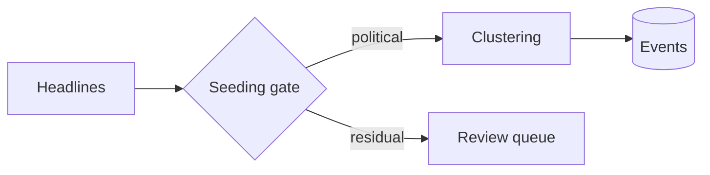

A scratch reference. Every feature below is rendered live, with the source shown
above it, so this page doubles as a test that the toolchain still works after a
theme update. Copy what you need; delete this post when it stops earning its keep.

Features that need a front-matter switch are listed at the top of this file:
`mermaid`, `chart.plotly`, `tabs`, `related_publications` and `toc`.

## Diagrams

Set `mermaid.enabled: true` in the front matter and put the diagram in a
`mermaid` fenced block.

````markdown

````


`mermaid.zoomable: true` makes the diagram click-to-zoom. Sequence, state, Gantt
and ER diagrams all work the same way; see the [mermaid docs](https://mermaid.js.org/).

## Embedded notebooks and visualisations

Both of the embeds below use **placeholder IDs and will show an error until you
swap in a real one.** The wrapper div is what makes them responsive — an iframe
with a fixed height breaks on a phone.

### Deepnote

Published notebook → Share → Embed gives you the URL. The pattern is
`https://embed.deepnote.com/<project-id>/<notebook-id>`.

```html
<div style="position: relative; padding-bottom: 62.5%; height: 0; overflow: hidden;">
  <iframe
    src="https://embed.deepnote.com/PROJECT_ID/NOTEBOOK_ID"
    style="position: absolute; top: 0; left: 0; width: 100%; height: 100%; border: 0;"
    loading="lazy"
    allowfullscreen
    title="Deepnote notebook"
  ></iframe>
</div>
```

<div style="position: relative; padding-bottom: 62.5%; height: 0; overflow: hidden;">
  <iframe
    src="https://embed.deepnote.com/PROJECT_ID/NOTEBOOK_ID"
    style="position: absolute; top: 0; left: 0; width: 100%; height: 100%; border: 0;"
    loading="lazy"
    allowfullscreen
    title="Deepnote notebook"></iframe>
</div>

### Flourish

Flourish offers a script embed and an iframe embed. Use the iframe — the script
version injects into the page and fights the theme's stylesheet.

```html
<div style="position: relative; padding-bottom: 60%; height: 0; overflow: hidden;">
  <iframe
    src="https://flo.uri.sh/visualisation/0000000/embed"
    style="position: absolute; top: 0; left: 0; width: 100%; height: 100%; border: 0;"
    loading="lazy"
    allowfullscreen
    title="Flourish visualisation"
  ></iframe>
</div>
```

<div style="position: relative; padding-bottom: 60%; height: 0; overflow: hidden;">
  <iframe
    src="https://flo.uri.sh/visualisation/0000000/embed"
    style="position: absolute; top: 0; left: 0; width: 100%; height: 100%; border: 0;"
    loading="lazy"
    allowfullscreen
    title="Flourish visualisation"></iframe>
</div>

Flourish asks that public embeds keep the "A Flourish data visualisation" credit
bar. The same wrapper works for Observable, Datawrapper and Tableau Public.

## Charts rendered in the page

For a chart built from data rather than embedded from elsewhere, set
`chart.plotly: true` and use a `plotly` fenced block holding the figure JSON.
Chart.js, ECharts and Vega-Lite are also available via `chart.chartjs`,
`chart.echarts` and `chart.vega_lite`.

**The numbers below are illustrative, not real survey figures.**

````markdown
```plotly
{
  "data": [
    {
      "x": ["2021", "2022", "2023", "2024", "2025"],
      "y": [48, 41, 36, 33, 39],
      "type": "scatter", "mode": "lines+markers", "name": "Support",
      "line": { "color": "#2563c9", "width": 2 }, "marker": { "size": 8 }
    },
    {
      "x": ["2021", "2022", "2023", "2024", "2025"],
      "y": [32, 38, 45, 49, 44],
      "type": "scatter", "mode": "lines+markers", "name": "Oppose",
      "line": { "color": "#c2610a", "width": 2 }, "marker": { "size": 8 }
    }
  ],
  "layout": {
    "title": { "text": "Example data — replace before publishing" },
    "yaxis": { "title": { "text": "Per cent" }, "range": [0, 60] },
    "margin": { "t": 48, "r": 16, "b": 40, "l": 56 }
  }
}
```
````

```plotly
{
  "data": [
    {
      "x": ["2021", "2022", "2023", "2024", "2025"],
      "y": [48, 41, 36, 33, 39],
      "type": "scatter", "mode": "lines+markers", "name": "Support",
      "line": { "color": "#2563c9", "width": 2 }, "marker": { "size": 8 }
    },
    {
      "x": ["2021", "2022", "2023", "2024", "2025"],
      "y": [32, 38, 45, 49, 44],
      "type": "scatter", "mode": "lines+markers", "name": "Oppose",
      "line": { "color": "#c2610a", "width": 2 }, "marker": { "size": 8 }
    }
  ],
  "layout": {
    "title": { "text": "Example data — replace before publishing" },
    "yaxis": { "title": { "text": "Per cent" }, "range": [0, 60] },
    "margin": { "t": 48, "r": 16, "b": 40, "l": 56 }
  }
}
```

Those two hues are checked for colour-vision separation. If you add a third
series, pick it deliberately rather than letting the library cycle its defaults.

## Code, in tabs

Set `tabs: true`. Useful for showing the same step in two languages.





```r
library(survey)

des <- svydesign(ids = ~1, weights = ~wt, data = poll)
svymean(~support, des, na.rm = TRUE)
```





```python
import pandas as pd
import numpy as np

w = poll["wt"]
est = np.average(poll["support"], weights=w)
```





## Mathematics

MathJax is on site-wide. Inline with `$$ ... $$` on one line, display on its own.

The standard error of a proportion under simple random sampling:

$$
SE(\hat{p}) = \sqrt{\frac{\hat{p}(1 - \hat{p})}{n}}
$$

For a design with clustering, multiply the variance by the design effect,
$$\text{deff}$$, before taking the root.

## Citing your own work

`related_publications: true` in the front matter, then cite by the key used in
`_bibliography/papers.bib`.



```liquid

```



Renders as:  — and the full reference is collected at the
foot of the post automatically.

## Images with captions



```liquid

```



Images get click-to-zoom from `enable_medium_zoom`. Put post images in
`assets/img/` and keep them under a few hundred kilobytes.

## Tables

Plain markdown tables work and pick up the theme's styling.

| Source | Frequency | First year |
| :----- | :-------- | ---------: |
| NHK    | Monthly   |       1950 |
| Jiji   | Monthly   |       1960 |
| Kyodo  | Irregular |       1979 |

## Other things the theme does

Not demonstrated here, but available: audio and video embeds, GeoJSON maps,
TikZ diagrams, pseudocode blocks, code-diff blocks, photo galleries, Jupyter
notebook rendering via `jekyll-jupyter-notebook`, and the Distill-style long-form
layout. Each had a sample post in the stock theme — check the al-folio
documentation if you need one back.
